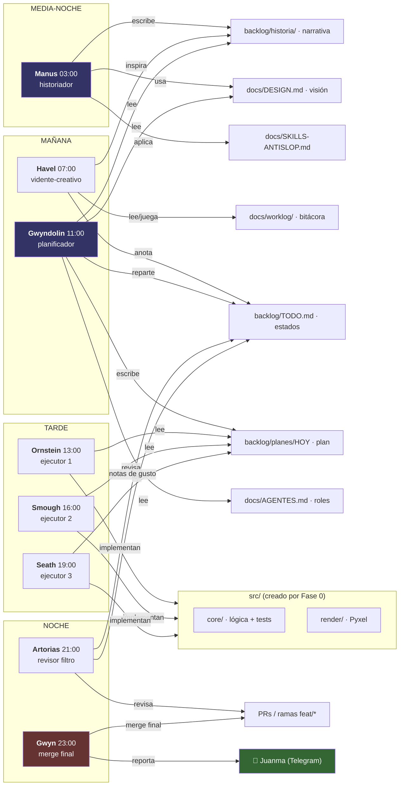

# AGENTES-MAPA — Estructura y navegación visual del Concilio

> 📍 **QUÉ ES:** esquema visual (Mermaid) de *dónde vive cada cosa* y *qué busca
> cada agente*. Complementa al `PROJECT-MAP.md` (que es el índice maestro en texto).
>
> **Cómo ver estos diagramas:**
> - **En GitHub**: el repo los renderiza solo (`.md` con bloques ```mermaid```).
> - **En Obsidian**: instala el plugin *Mermaid* (o soporte nativo) para verlos.
> - En local, abre este archivo en cualquier visor de Markdown con Mermaid.
>
> 🔥 **VERSIÓN INTERACTIVA:** este Mermaid es el respaldo en texto. La versión
> visual completa (retratos, flujo animado, 3 niveles de detalle) está en
> **`docs/mapa/index.html`** — ábrelo en cualquier navegador. También sirve en
> GitHub Pages (`/docs/mapa/`).

---

## 1. Estructura de carpetas del repo (dónde está qué)

```mermaid
flowchart TD
    ROOT["<b>CyberRoot/</b> <i>(raíz)</i>"] --> README["<b>README.md</b><br/>cara pública: identidad, flujo, Concilio"]
    ROOT --> GITIGNOR[".gitignore"]
    ROOT --> BACKLOG["<b>backlog/</b><br/><i>LA COLA DE TRABAJO (vivo)</i>"]
    ROOT --> DOCS["<b>docs/</b><br/><i>EL CONOCIMIENTO (permanente)</i>"]
    ROOT --> TOOLS["<b>tools/</b><br/>utilidades (cyberroot_usage.py)"]

    BACKLOG --> TODO["TODO.md<br/><i>estados de tareas (pend/curso/hecho)</i>"]
    BACKLOG --> PLAN["planes/YYYY/MM/DD.md<br/><i>plan del HOY (histórico por fecha)</i>"]
    BACKLOG --> HIST["historia/<br/><i>INDICE · PERSONAJES · ESCENARIOS · CAPITULOS/</i>"]
    BACKLOG --> MEJORAS["MEJORAS.md<br/><i>buzón de auto-mejora</i>"]

    DOCS --> AGPLAN["AGENTS-PLAN.md<br/><i>plan maestro del sistema</i>"]
    DOCS --> AGENTES["AGENTES.md<br/><i>roles del Concilio + delegación + skills</i>"]
    DOCS --> PMAP["PROJECT-MAP.md<br/><i>índice maestro</i>"]
    DOCS --> DESIGN["DESIGN.md<br/><i>diseño del juego (lo produce la Fase 0)</i>"]
    DOCS --> ISTACK["INVESTIGACION-STACK.md<br/><i>stack técnico (Pyxel, core/render)</i>"]
    DOCS --> RMEC["RESEARCH-MECANICAS.md<br/><i>mecánicas / dopamina (Fase 0)</i>"]
    DOCS --> ASLOP["SKILLS-ANTISLOP.md<br/><i>guía anti-AI-slop (en Fase 0)</i>"]
    DOCS --> BRAIN["BRAINSTORM.md<br/><i>ideas en crudo</i>"]
    DOCS --> DISO["DISENO-SISTEMA.md<br/><i>borrador SUPERSEDIDO</i>"]
    DOCS --> ESREPO["ESTRUCTURA-REPO.md<br/><i>borrador SUPERSEDIDO</i>"]
    DOCS --> USAGE["USAGE.md<br/><i>panel de uso/coste (autogenerado)</i>"]
    DOCS --> WL["worklog/YYYY/MM/DD.md<br/><i>bitácora diaria</i>"]

    style BACKLOG fill:#1b3a2b,color:#fff
    style DOCS fill:#1a2a3a,color:#fff
```



---

## 2. Qué busca cada agente (por turno)



---

## 3. Regla de oro del acceso (para cualquier agente)

```
LEE en orden (Paso 0, AGENTS-PLAN §2.5):
1. docs/PROJECT-MAP.md   → visión general
2. docs/AGENTES.md       → qué hace cada agente
3. backlog/TODO.md       → estados
4. docs/DESIGN.md        → la visión que no puedes romper
5. (según tu rol) planes/historia/investigación
6. backlog/MEJORAS.md    → auto-mejora pendiente

NO leas el código entero del repo. Solo lo que necesites para tu tarea.
```